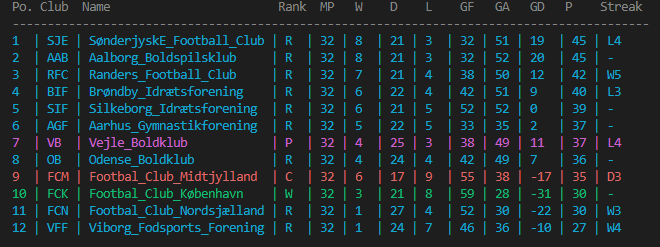

# kea-cs-football
This program can be used to create a table of football teams statistics in the console. This repository provides it's own csv files but you are more than welcom to supply your own, just remember to use the same folder structure as this repository.

Simply run the command "dotnet run", see example of the output below.
